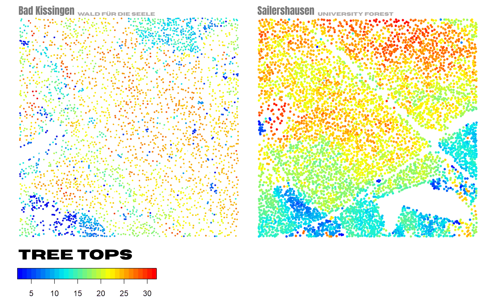
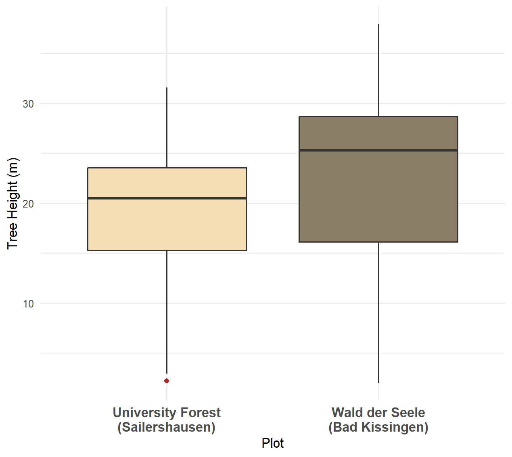
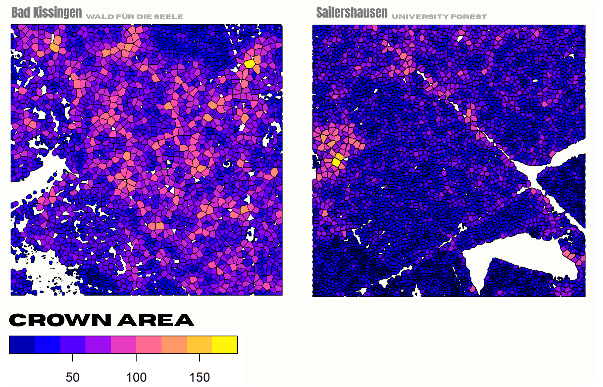
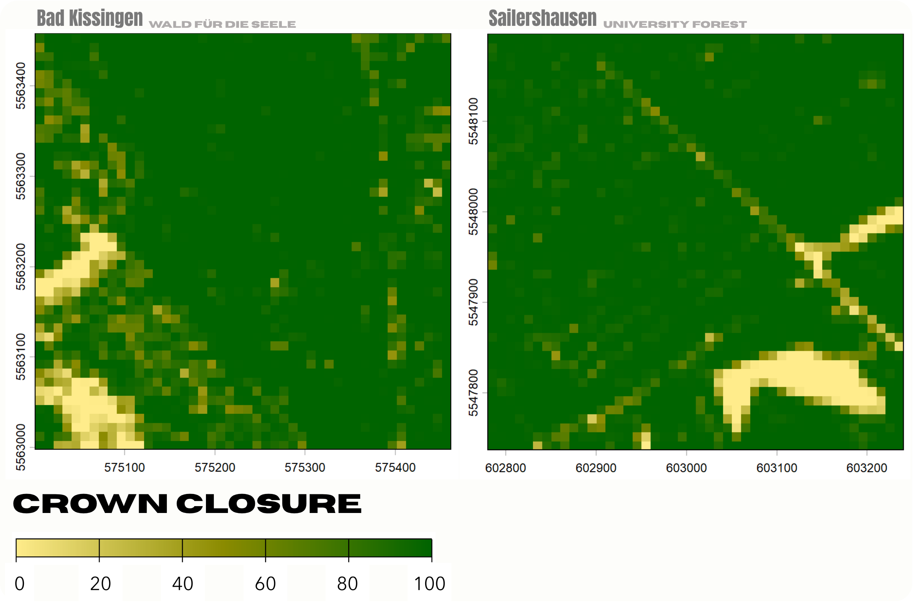
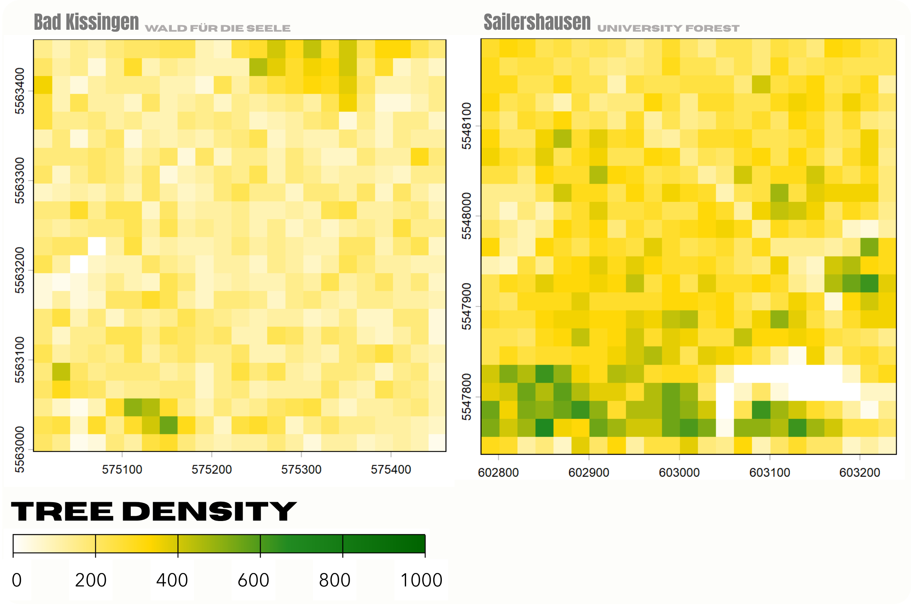
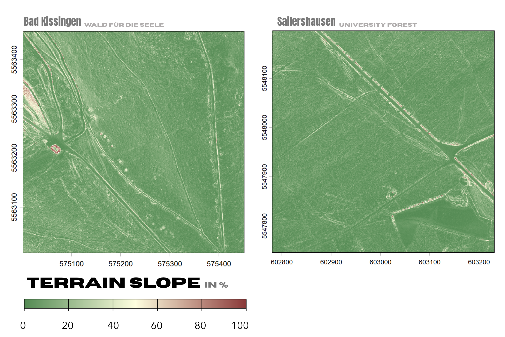
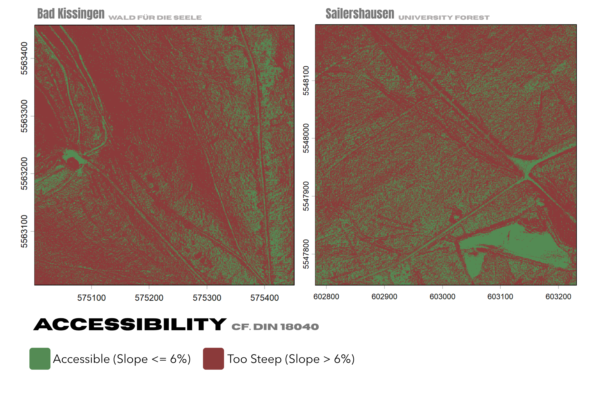

# Forest-Structure-Recreational-Value-A-LiDAR-Based-Comparison
A standardized LiDAR workflow in R analyzing and comparing forest structure parameters between a designated healing forest ('Wald für die Seele', Bad Kissingen) and a managed forest ('University Forest Sailershausen') using the lidR package.

## Study Motivation
The phrase "forests are good for you" ("Wald tut gut")  reflects a widely held belief (Wald für die Seele 2023; Galuska 2023). Forests serve as essential environments for health and recreation, allowing individuals to escape everyday stress, noise, and urban hectic. However, the growing demand for recreational spaces introduces new expectations for forest management (Wagner et al. 2022).
### This study adresses the folowing questions:
1. How do recreation-relevant forest structure parameters derived from airborne LiDAR data (ALS) differ between a designated recreational forest and a production-oriented commercial forest?
2. To what extent do these different forest types offer accessible, barrier-free terrain?

## Study Area
The Area of Interest (AOI) was manually defined via point cloud segmentation within the open-source software 'CloudCompare'. The AOI is divided into two distinct forest plots, each covering an extent of approximately 20 hectares.

### Forest Plots
#### Wald für die Seele, Bad Kissingen
The "Wald für die Seele" (Forest for the Soul) is a 14.5 hectare nature experience and art project located within the Klauswald in Bad Kissingen, managed by the Foundation for Consciousness Sciences since 2015. The project aims to demonstrate how nature and biodiversity promote mental, physical, and social well-being. It serves as a dedicated space for ecotherapy, meditation, reflection, and the experience of art in nature (Wald für die Seele 2023; Galuska 2023).

#### University Forest, Sailershausen
The "University Forest Sailershausen" covers approximately 2,300 hectares near Haßfurt and is managed by the forestry office of the University of Würzburg. Operating as a sustainable commercial forest, its tree composition is dominated by deciduous species. In addition to fulfilling ecological functions like a large bird sanctuary, the woodland serves a dual purpose as a production forest and a scientific research area for academic institutions (Schmidt/Täufer 2023; DFV 2017).

## Data Source
The raw datasets utilized in this study were obtained from the OpenData portal of the Bavarian Agency for Digitisation (Bayerische Vermessungsverwaltung (BVV)) and consist of Airborne Laser Scanning (ALS) point clouds. The flight campaign for the University Forest Sailershausen took place between January 18 and February 1, 2025, while the "Wald für die Seele" was surveyed between January 10 and January 28, 2024. 
Both datasets feature a minimum point density of 4 points/m². The vertical accuracy is approximately 0.12 m in flat, open terrain, while the horizontal positioning accuracy is around 0.30 m (BVV 2026).

---

# Workflow

## Derivation of Forest Structure Parameters using the [lidR](https://github.com/r-lidar/lidR) package

### Environment Setup & Data Loading

```R
library(lidR)
library(terra)  
library(sf)     
library(dplyr)
library(ggplot2)

# Set working directory and load segmented point cloud
setwd("D:/LiDen/Daten")
las <- readLAS("603_5547_seg.laz", filter = "-drop_withheld")

# Assign Coordinate Reference System (CRS: ETRS89 / UTM zone 32N)
crs(las) <- 25832

# Set local export path and inspect raw point cloud
setwd("D:/LiDen/Daten/Sailershausen/lidR_Sailershausen")
plot(las)
```

### DTM Generation, Canopy Modeling and Tree Segmentation

#### DTM Creation & Height Normalization
A Digital Terrain Model (DTM) is generated at a 0.2 m resolution using a k-nearest neighbor interpolation with inverse distance weighting (knnidw). This DTM is used to normalize the point cloud, converting absolute elevations into true tree heights above the ground.

```R
## DTM Creation & Height Normalization
dtm <- rasterize_terrain(las, res = 0.2, algorithm = knnidw())
las_norm <- normalize_height(las, dtm)
```

#### Treetop Detection
Individual treetops are located using a Local Maximum Filter (lmf) with a dynamic window size defined by a custom height function to adjust for varying crown widths.

```R
## Treetop Detection
f <- function(x) { x * 0.1 + 3 }
ttops <- locate_trees(las = las_norm, algorithm = lmf(f), uniqueness = "bitmerge")
plot(ttops["Z"], cex = 0.5, pch = 19, pal = height.colors, nbreaks = 30, main = "Detected Treetops")
```

#### Canopy Height Model (CHM)
A pit-free Canopy Height Model (CHM) is rasterized at a 0.5 m resolution and subsequently smoothed using a 3x3 median filter (terra::focal) to eliminate spatial artifacts and data pits.

```R
## Canopy Height Model (CHM)
chm <- rasterize_canopy(las = las_norm, res = 0.5, algorithm = pitfree(subcircle = 0.15))
# Smooth CHM to reduce artifacts
kernel <- matrix(1, 3, 3)
chm_smooth <- terra::focal(chm, w = kernel, fun = median, na.rm = TRUE)
plot(chm_smooth, main = "Smoothed Canopy Height Model")
```

#### Tree Segmentation and Crown Metrics
* **Tree Segmentation:** Individual trees are isolated using the `silva2016` algorithm based on the smoothed CHM and detected treetops.
* **Metrics Extraction:** Standard forest metrics are derived via `crown_metrics()` using two geometric approaches:
  * `geom = "point"` → Extracts precise spatial locations and individual tree heights ($Z$).
  * `geom = "convex"` → Computes crown areas using calculated convex hulls.

```R
## Tree Segmentation & Crown Metrics
# Segment trees using Silva et al. (2016) algorithm
algo <- silva2016(chm_smooth, ttops)
las_seg <- segment_trees(las_norm, algo)

## Derive crown metrics (Convex Hull for area and Points for locations)
crowns <- crown_metrics(las_seg, func = .stdtreemetrics, geom = "convex")
trees_lidar <- crown_metrics(las_seg, func = .stdtreemetrics, geom = "point")
plot(crowns["convhull_area"], main = "Crown area (convex hull)")
plot(trees_lidar["Z"], main = "Tree heights", pch = 16)
summary(crowns$convhull_area)
```

### Inventory Data Export for TreeCompare

```R
## Export Inventory Data for TreeCompare
inventory_table <- as.data.frame(sf::st_coordinates(trees_lidar))
names(inventory_table) <- c("x", "y")
inventory_table$hoehe <- trees_lidar$Z
inventory_table$kronenflaeche <- trees_lidar$convhull_area

## Save dataset
write.csv2(inventory_table, "Baumparameter_603_5547.csv", row.names = FALSE)
```

---

### Density Metrics: Stem Density and Canopy Cover
* **Stem Density ($N/\text{ha}$):** Treetop point geometries are rasterized onto a fine 1 m grid to log tree presence. 
  * Aggregation → Pixels are grouped into a **20x20 m forest inventory grid** (400 $\text{m}^2$).
  * Hectare Extrapolation → To scale the local tree count up to a standard hectare (10,000 $\text{m}^2$), values are multiplied by a scaling factor of 25 ($10,000 / 400 = 25$).
* **Canopy Cover (%):** The smoothed Canopy Height Model (CHM) is thresholded at 2 meters to isolate the upper canopy layer from low vegetation and ground noise.
  * Aggregation → The binary mask is aggregated to the same 20x20 m grid to compute the percentage of crown coverage.
* **Geospatial Export:** The resulting stem density matrix is exported as a GeoTIFF raster (`stammzahl_dichte_sail.tif`) for spatial mapping and statistical comparison across the plots.

```R
## Stem Density (Trees per Hectare)
# Rasterize treetop locations at 1m resolution
fine_raster <- terra::rast(ttops, res = 1)
stem_presence <- terra::rasterize(ttops, fine_raster, fun = "length", background = 0)

# Aggregate to 20x20m grid cells (400 sqm)
stem_sum_20m <- terra::aggregate(stem_presence, fact = 20, fun = sum, na.rm = TRUE)

# Extrapolate to 1 hectare scale (factor: 10000 / 400 = 25)
stammzahl_dichte <- stem_sum_20m * 25

## Canopy Cover (%)
# Threshold CHM at 2 meters height and aggregate to 20x20m grid cells
crown_mask <- chm_smooth > 2
kronenschluss <- terra::aggregate(crown_mask, fact = 20, fun = mean, na.rm = TRUE) * 100

# Plot Canopy Cover
plot(kronenschluss, 
     main = "Canopy Cover (%)", 
     col = colorRampPalette(c("lightgoldenrod1", "yellow4", "darkgreen"))(255),
     range = c(0, 100),
     plg = list(title = "Cover (%)"))

## Export stem density raster
terra::writeRaster(stammzahl_dichte, "D:/LiDen/Daten/Sailershausen/lidR_Sailershausen/stammzahl_dichte_sail.tif", overwrite = TRUE)
```
---

## Terrain Analysis: Slope and Accessibility

### Slope Derivation
The code extracts topographic information from the previously generated Digital Terrain Model (DTM) using the `terra` package:

* **Slope Calculation:** The function `terra::terrain()` computes the surface slope in radians based on the cellular elevation differences.
* **Unit Conversion:** Radians are converted into slope percentage (%) using the trigonometric tangent transformation ($\tan(\text{slope}_{\text{rad}}) \times 100$).
* **Visualization:** Generates a 2D topographic map using a continuous color ramp (`terrain_colors`) scaled from 0% (flat ground, green) to 100% (steep terrain, red).
* 
```R
## Calculate slope in radians and convert to percentage
slope_rad <- terra::terrain(dtm, v = "slope", unit = "radians")
slope_pct <- tan(slope_rad) * 100

# Color palette
terrain_colors <- colorRampPalette(c("palegreen4", "lightyellow", "indianred4"))(255)

# Plot Slope
plot(slope_pct, 
     main = "Terrain Slope (%)", 
     col = terrain_colors,
     range = c(0, 100),
     plg = list(title = "Slope (%)"))
```

### Terrain Accessibility Classification
This step performs a binary threshold analysis to classify the terrain based on machine or operational accessibility constraints. By evaluating the slope percentage grid, it isolates all regions with a slope less than or equal to 6%, outputting a boolean logical raster. This mask is then converted into a categorical factor raster to assign explicit land management classes. Finally, the script generates a classified map using distinct operational colors: red for areas that are too steep for standard machinery (>6%), and green for safely accessible operating zones (<=6%).

```R
## Calculate accessibility threshold (slope less than or equal to 6%)
accessible_areas <- slope_pct <= 6

# Plot accessibility classification
plot(as.factor(accessible_areas), 
     main = "Accessibility Map\n (Slope <= 6%)", 
     col = c("indianred4", "palegreen4"),
     type = "classes",
     levels = c("Too Steep (>6%)", "Accessible (<=6%)"))
```

---
## Statistic Compact: Forest Structure Parameters
The script processes the LiDAR data independently to derive statistical key forest structure parameters, including tree height, crown area, stem density, and canopy cover. It summarizes these parameters using mean, median, and maximum values for the study area.

```R
##STATISTSIC COMPACT: Forest Structure Parameters

library(lidR)
library(terra)
library(sf)

#Load Data
setwd("D:/LiDen/Daten")

las <- readLAS(
  "603_5547_seg.laz",
  filter = "-drop_withheld"
)
crs(las) <- 25832

#Create DTM (20 cm resolution) and normalize tree heights 
dtm <- rasterize_terrain(
  las,
  res = 0.2,
  algorithm = knnidw()
)

las_norm <- normalize_height(las, dtm)

#Detect TreeTops
f <- function(x) {
  x * 0.1 + 3
}

ttops <- locate_trees(
  las_norm,
  algorithm = lmf(f),
  uniqueness = "bitmerge"
)


#Create and smooth Canopy Height Model (CHM)
chm <- rasterize_canopy(
  las_norm,
  res = 0.5,
  algorithm = pitfree(subcircle = 0.15)
)

chm_smooth <- terra::focal(
  chm,
  w = matrix(1, 3, 3),
  fun = median,
  na.rm = TRUE
)


#Segment individual trees and calculate crown metrics
las_seg <- segment_trees(
  las_norm,
  silva2016(chm_smooth, ttops)
)

#Calculate standard tree metrics and crown area
trees <- crown_metrics(
  las_seg,
  func = .stdtreemetrics,
  geom = "convex"
)


#Extract tree height and crown area
inventory <- data.frame(
  height = trees$Z,
  crown_area = trees$convhull_area
)


#Calculate stem density (trees per hectare)
fine_raster <- terra::rast(
  ttops,
  res = 1
)

stem_presence <- terra::rasterize(
  ttops,
  fine_raster,
  fun = "length",
  background = 0
)

stem_sum_20m <- terra::aggregate(
  stem_presence,
  fact = 20,
  fun = sum,
  na.rm = TRUE
)

# Convert trees per 400 m² into trees per hectare
# 1 hectare = 10,000 m²
# 10,000 / 400 = 25
stem_density <- stem_sum_20m * 25


#Calculate canopy cover
crown_mask <- chm_smooth > 2

# Calculate the percentage of canopy cover within 20 x 20 m cells
canopy_cover <- terra::aggregate(
  crown_mask,
  fact = 20,
  fun = mean,
  na.rm = TRUE
) * 100


#OVERVIEW!
stats_summary <- data.frame(
  Metric = c(
    "Mean Tree Height",
    "Median Tree Height",
    "Maximum Tree Height",
    "Mean Crown Area",
    "Median Crown Area",
    "Mean Stem Density (trees/ha)",
    "Mean Canopy Cover (%)"
  ),
  Value = c(
    mean(inventory$height, na.rm = TRUE),
    median(inventory$height, na.rm = TRUE),
    max(inventory$height, na.rm = TRUE),
    mean(inventory$crown_area, na.rm = TRUE),
    median(inventory$crown_area, na.rm = TRUE),
    mean(terra::values(stem_density), na.rm = TRUE),
    mean(terra::values(canopy_cover), na.rm = TRUE)
  )
)

print(stats_summary)
```

## Statistical Tree Height Comparison
This step compiles the inventory datasets from both forest stands into a standardized dataframe to statistically compare tree heights. Using `ggplot2`, it generates a comparative boxplot that directly contrasts the height distributions.

```R
library(ggplot2)
library(dplyr)

# Load inventory parameters for both forest plots
df_raw_bk <- read.csv2("D:/LiDen/Daten/BK/lidR_BK/Baumparameter_575_5563.csv")
df_raw_sail <- read.csv2("D:/LiDen/Daten/Sailershausen/lidR_Sailershausen/Baumparameter_603_5547.csv")

# Location Labels
df_raw_bk$Location <- "Wald der Seele\n(Bad Kissingen)"
df_raw_sail$Location <- "University Forest\n(Sailershausen)"

# Standardize columns and merge datasets into a single dataframe
height_comparison <- rbind(
  data.frame(Hoehe = df_raw_bk$hoehe, Location = df_raw_bk$Location),
  data.frame(Hoehe = df_raw_sail$hoehe, Location = df_raw_sail$Location)
)

# Boxplot: Comparison of Forest Stands
ggplot(height_comparison, aes(x = Location, y = Hoehe, fill = Location)) +
  geom_boxplot(outlier.color = "firebrick", outlier.shape = 16, outlier.size = 1.5) +
  # Map specific fill colors to each plot location
  scale_fill_manual(values = c(
    "University Forest\n(Sailershausen)" = "wheat", 
    "Wald der Seele\n(Bad Kissingen)" = "wheat4"
  )) +
  labs(
    x = "Plot",
    y = "Tree Height (m)"
  ) +
  theme_minimal() +
  theme(
    legend.position = "none", # Hide redundant legend since x-axis provides context
    axis.text.x = element_text(size = 11, face = "bold", lineheight = 0.9) # Format text layout
  )
```

  ---

## Results
The following section presents the key results of the workflow, including the relevant visualizations and statistical analyses. The figures provide a direct comparison of forest structure and terrain characteristics between the Forest for the Soul in Bad Kissingen and the University Forest Sailershausen, interpreted in the context of relevant scientific literature.

### **1) Tree Tops & Tree Height**
A forest structure that contributes to recreation is described as a multi-layered mixed forest with diverse height and age structures. Furthermore, an irregular tree distribution and density contribute to a varied forest scenery, which effectively conveys the desired sense of naturalness (Wagner et al., 2022; Immich & Robl, 2023).




The Tree Top visualization shows the ALS detected tree tops for both plots: 3261 trees in the Forest of the Soul (Bad Kissingen) and 5767 in the University Forest (Sailershausen).
A comparative analysis of the spatial patterns and the Tree Height Boxplots reveal distinct structural differences between the two forest stands:
Forest for the Soul (Bad Kissingen) features a lower stem density characterized by an irregular spatial distribution of trees. The average tree height is 23.84 meters, displaying a heterogeneous mixture of various height classes across the entire area.
University Forest (Sailershausen) exhibits a significantly higher stem density with an average tree height of 19.52 meters. A spatial gradient is observable, showing a steady decrease in tree height from north to south. The stand displays a structured, linear organization, including clear linear gaps aligned from northeast to southwest, along with matching geometric tree rows.

### **2) Crown Area**
Wide branches and large tree canopies are recommended as structures that convey a sense of shelter and security. For recreational forests, it is advised to preserve large-crowned trees (Immich et al. 2022). Varied or unique lighting conditions resulting from a heterogeneous arrangement of different canopy sizes are described as a distinct quality criterion of recreational forests, as they create a diverse and high-contrast forest scenery (Wagner et al. 2022; Immich et al. 2022).



The visualization of the crown area illustrates the crown sizes of both plots in square meters. An analysis of the Forest for the Soul (Bad Kissingen) plot reveals a heterogeneous, irregular composition of varying canopy sizes, including several individuals that exceed a substantial area of 150 square meters. The average crown area within this stand is 59.05 square meters.
In contrast, the University Forest (Sailershausen) stand exhibits only isolated tree crowns exceeding 150 square meters, which are clustered in the western section of the plot. The average crown area here is 32.97 square meters, and the stand is characterized by a rather small and largely homogeneous distribution of canopy sizes.

### **3) Crown Closure**
Depending on the degree of canopy closure, light and shadow play out in various ways, contributing to both the restorative value and aesthetic appeal of the forest (Immich et al., 2022). The literature recommends a predominantly closed canopy interspersed with mosaic-like clearings. This structural configuration fosters higher humidity, reduces thermal heating, provides shelter from UV radiation, wind, and rain, and enhances the overall microclimate within the forest stand (Wagner et al., 2022; Immich & Robl, 2023; Immich et al., 2022).



The visualization above depicts the canopy closure percentage for both study plots. A comparison between the two sites reveals similarly high average canopy closure values, with teh Forest for the Soul (Bad Kissingen) averaging 90.33% and the University Forest (Sailershausen) reaching 91.63%. Both stands are dominated by a dense, closed canopy. However, spatial variations are prominently marked by low canopy closure values. In Bad Kissingen, a distinct, larger opening and lighter spots are concentrated in the southwestern section of the plot, alongside a narrower linear feature along the eastern edge. In Sailershausen, clear diagonal linear features, accompanied by a clearing in the southeastern corner.

### **4) Tree Density**
To provide alternating light conditions while simultaneously offering a sense of retreat, shelter, and security, individual denser forest patches within an overall open stand with wider tree spacing are favored. This structural composition ensures both sufficient visual depth and easy physical accessibility for forest visitors (Immich et al. 2022).



The visualization above presents the spatial variation in tree density across both study plots. A comparative assessment shows that Bad Kissingen exhibits an overall low tree density with a mean of 154.21 stems per hectare (N/ha), dominated by light yellow values with only minor, localized clusters along the northern border and near the southern edge. In contrast, the Sailershausen plot displays a noticeably higher tree density, averaging 272.59 N/ha. It features a distinct spatial gradient with a prominent, highly dense belt extending across the southern boundary, alongside a localized high-density cluster in the eastern section of the plot.

### **5) Terrain Slope & Accessibility**
Terrain slope is an important aspect of topography and is primarily associated with three factors: accessibility, physical exertion, and the experiential value of a forest. In the Bavarian criteria catalog for healing and curative forests, topography—alongside forest size, accessibility, tranquility, and air purity—is listed among the general requirements (Immich et al. 2022). This parameter is particularly relevant for individuals with mobility impairments. Consequently, the terrain directly influences how strenuous, safe, and inclusive a forest experience can be (Wagner et al. 2022; Immich & Robl 2023; Immich et al. 2022). For publicly accessible buildings and their surrounding circulation areas, the German standard DIN 18040 specifies a maximum slope of 6% (BStMI 2010).



The spatial visualization depicts the terrain slope percentage across both study plots, revealing notable topographic differences between the two areas.

The Forest for the Soul (Bad Kissingen) plot exhibits a more heterogeneous topography with pronounced slope variations. While the majority of the terrain is characterized by gentle to moderate inclines (dark green to light green), steep slopes reaching up to and exceeding 60% (beige to reddish-brown shades) are prominently clustered in the western and northwestern sections, alongside a distinct steep localized depression or micro-relief feature in the central-western area. Furthermore, linear terrain features such as paths and embankment edges stand out clearly through sharper local slope gradients.

In contrast, the University Forest (Sailershausen) plot is dominated by consistently gentle terrain with low slope values (predominantly green shades) across most of the area. Notable slope increases are primarily restricted to anthropogenic or structural features, such as the embankments along the diagonal forest roads and paths, as well as a distinct polygon with sharp structural edges in the southeastern corner. Overall, Sailershausen presents a considerably flatter and topographically more uniform terrain compared to the more rugged surface structure of Bad Kissingen.



The accessibility map categorizes terrain suitability based on the 6% slope threshold defined by DIN 18040, classifying areas with slopes of 6% or less as accessible (green) and steeper areas as unsuitable for barrier-free access (red).

In the Forest for the Soul (Bad Kissingen) plot, terrain classified as accessible is predominantly confined to linear features along paths and forest tracks, as well as a small concentrated patch in the west, while the majority of the surrounding area exceeds the 6% threshold. In contrast, the University Forest (Sailershausen) plot exhibits a more diffuse and widespread distribution of accessible terrain, with green areas scattered throughout the stand alongside continuous accessible corridors along the main diagonal forest roads and within the southeastern polygon.

---

## Discussion and Conclusion

The results demonstrate structural differences between the designated recreational Forest for the Soul in Bad Kissingen and the production-oriented University Forest Sailershausen. Regarding the first research question, the LiDAR-derived parameters indicate that the Forest for the Soul exhibits several structural characteristics that are consistent with the forest features described in the literature as beneficial for recreation and restorative experiences: The stand is characterized by a lower tree density of 154.21 trees/ha, a higher mean tree height of 23.84 m, and substantially larger average crown areas of 59.05 m². In addition, the spatial distribution of tree tops and crown sizes is considerably more heterogeneous and irregular. These characteristics provide a more varied forest structure with different height classes, crown dimensions, and spatial patterns, potentially supporting the visual diversity, naturalness, and alternating light conditions associated with recreational forest environments (Wagner et al. 2022; Immich et al. 2022; Immich & Robl 2023).

In contrast, Sailershausen shows a denser and more structurally uniform stand, with 272.59 trees/ha, a lower mean tree height of 19.52 m, and a substantially smaller mean crown area of 32.97 m². The visible linear tree arrangements and geometric gaps further suggest a more regular spatial organization, which is consistent with its function as a managed production forest. However, the high mean canopy closure of 91.63% demonstrates that Sailershausen also provides a predominantly closed canopy, which is considered beneficial for shade, shelter, and microclimatic conditions (Immich & Robl, 2023; Immich et al., 2022). Interestingly, canopy closure is similarly high in Bad Kissingen at 90.33%, indicating that this parameter alone does not clearly distinguish the two forest types. Overall, the comparison therefore suggests that tree density, crown size, height variation, and spatial heterogeneity are more informative for distinguishing the recreational characteristics of the two sites than canopy closure alone (Wagner et al., 2022).

The findings provide a positive answer to the first research question: the designated recreational forest differs from the production-oriented forest in several recreation-relevant structural parameters, particularly through its lower stem density, larger crowns, greater average tree height, and more heterogeneous spatial structure. These characteristics correspond more closely to the structural recommendations for recreational forests described in the literature (Wagner et al. 2022; Immich et al. 2022; Immich & Robl 2023). Nevertheless, the results should not be interpreted as proof that Bad Kissingen has a higher recreational or therapeutic effect. Recreational value is influenced by additional factors such as noise, visual quality, biodiversity, infrastructure, visitor perception, air quality, and the presence of paths and recreational facilities, which are not directly captured by the LiDAR analysis (Wagner et al., 2022).
Regarding the second research question, the results reveal an important contrast in terms of terrain accessibility. The forest for the Soul site has a considerably more heterogeneous and rugged topography, with extensive areas exceeding the 6% slope threshold used in this study. Areas classified as accessible are mainly concentrated along existing paths and forest tracks. Sailershausen, in comparison, is characterized by a more uniform terrain, resulting in a considerably more widespread distribution of areas below the 6% threshold. From a purely topographic perspective, this indicates that Sailershausen provides more favorable conditions for barrier-free movement, whereas the more recreationally oriented Bad Kissingen site is structurally more challenging for visitors with limited mobility (Immich et al. 2022; BStMI 2010).

This finding highlights an important trade-off between forest structure and physical accessibility. Forest for the Soul appears to provide a forest structure that is particularly well aligned with several recreation-oriented criteria, but its heterogeneous terrain may limit accessibility for some visitor groups. Sailershausen, on the other hand, offers considerably more accessible terrain but exhibits a denser and more regular forest structure. Consequently, neither site can be considered universally superior in terms of recreational suitability. Instead, the two forests provide different combinations of structural and topographic characteristics.

The accessibility assessment should also be interpreted with caution. The 6% threshold derived from DIN 18040 provides a useful reference for identifying potentially accessible terrain, but it is primarily intended for built environments and circulation areas rather than natural forest terrain (BStMI 2010). Therefore, areas classified as exceeding 6% should not automatically be interpreted as completely inaccessible, and actual accessibility also depends on path surfaces, path width, obstacles, drainage, maintenance, and the design of the existing trail network.

Overall, the study demonstrates the potential of airborne LiDAR and the `lidR` workflow in R to provide a standardized and spatially explicit assessment of forest structure. The analysis successfully differentiates the two forest types and shows that LiDAR-derived parameters can be used to evaluate several structural characteristics relevant to recreational forest management. The results suggest that the designated recreational forest in Bad Kissingen better corresponds to the structural criteria associated with naturalness, heterogeneity, and visual diversity, while the University Forest in Sailershausen offers substantially more favorable topographic conditions for barrier-free access. The findings therefore emphasize that recreational forest quality is multidimensional and requires a balance between attractive and heterogeneous forest structures and sufficient physical accessibility.
